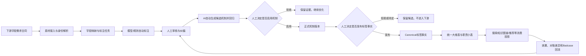

# TPENG 新标签体系方案（最终宣讲版 / 研发启动版）

> 版本：v2.0（2026-08-17）
>
> 产品名称：TPENG 标签实验台（LabelLab）
>
> 适用范围：统一标签体系产品载体、标签/内容中台通用底座、3D/SU 首个真实闭环
>
> 文档状态：方案结论已冻结；真实数据、真实模型、生产数据库写入和生产发布仍按专项合同执行

## 一、先说结论

我们不再单独建设一套“标签体系重构系统”。

**TPENG 标签实验台就是新标签体系的事实产品，也是标签/内容中台的通用底座。**

标签实验台原来已经具备美感和质量分级评测能力，下一步在同一平台上增加属性标签、分类、风格、材质、结构特征等固定字段的标注和治理能力。下游的具体需求以扩展模块接入，平台通用能力只建设一份，业务类目通过配置和专用视图扩展，不再复制第二套后台。

平台最终承接一条完整链路：

> 下游字段需求合同 → 素材接入 → 标注任务 → 自动与人工标注 → 纠偏验收 → 版本发布 → 下游引用与对账 → Badcase 回流

首个真实验证目标是 **2026 年 9 月跑通 3D/SU 标签闭环**。这次验证不是只证明“模型能打分”，而是证明标签能够生产、审核、发布、落到下游表、被消费并且能根据效果回流改进。

## 二、背景与现状

### 2.1 已有基础

当前已经有 TPENG 标签实验台（LabelLab），并已形成以下能力骨架：

- 主模型和调优模型注册管理；
- 类目评测机制、Prompt A/B、V3 合同及多版本管理；
- 增量评测和存量回归两个工作区；
- 自动标注、人工审核、人工纠偏和证据留痕；
- AI 自动分析纠偏样本、生成候选机制并执行回归；
- 机制发布轴与标签事实发布轴；
- 五档评测矩阵、精确等级准确率、相邻等级准确率和分档 Precision/Recall；
- 黄金数据集、存量重跑、下游投影和 Badcase 回流的底座合同；
- 资产身份、字段合同、版本、哈希和对账边界。

这些能力目前主要完成了本地实现、确定性验证和测试环境准备。真实上游、真实模型调用、真实数据库写入、权限和生产回退仍需按专项合同单独确认，不能把本地 fixture、dry-run 或测试环境结果当成生产事实。

### 2.2 为什么现在把标签体系并入实验台

下游现在提出的需求已经不只是美感分或质量分，还包括属性标签、分类字段、风格、材质、结构特征以及面向知识图谱、搜索、筛选和推荐的固定字段。若另起一套标签系统，会再次产生一套素材、模型、任务、审核、版本和发布管理。

正确做法是把标签实验台升级为统一的标签事实生产平台：

- 美感评测是其中一个业务能力模块；
- 属性标签、分类和类目字段是可插拔的扩展模块；
- 模型、任务、审核、版本、发布、投影和回流是平台公共能力；
- 3D、SU、灵感图、Proposal PDF 等类目只提供自己的字段和评测机制。

## 三、当前痛点

### 3.1 没有统一的素材标签处置中台

素材从不同系统进入后，接入、定性、评测、人工修改和落表通常由不同工具或不同人员处理。出现错误时，很难回答：这是哪一批素材、哪一个版本、哪套机制、哪个模型、哪位审核人造成的。

### 3.2 数据库表越来越多，但维护规则越来越不清楚

现在有主表、扩展表、业务结果表、搜索表、知识图谱表和各种临时表。表里经常重复保存同一类字段，却没有统一的字段定义、版本和来源。时间一久，大家只能“找一张看起来像的表”，无法确认哪张才是事实。

### 3.3 类目差异很大，重复建设代价高

3D/SU、灵感图、Proposal PDF 等类目的评测方式不同，但模型管理、任务调度、人工纠偏、版本治理、发布、重跑、对账和回流应该共用。若每个类目都重新建设，最后会得到多个模型中心、多个审核后台和多个发布入口。

### 3.4 人工纠偏和 AI 迭代没有形成简单清晰的协作方式

人工纠偏需要能改结果、写原因、留证据；AI 需要自动分析这些纠偏样本，找出规则和提示词的缺口，形成新候选并回归验证。人工点击启动后，系统应自动接管运行，不应该再让人工补填一堆技术配置；但候选是否启用、正式标签是否发布，仍必须由人工决定。

### 3.5 下游效果无法稳定回流

下游消费出现错标、漏标或筛选效果下降时，当前缺少统一的 Badcase 入口、证据格式、版本关联和回流队列，导致问题只能在线下沟通，无法持续改进标准。

## 四、解决方案总览

### 4.1 一个产品、一个平台内核

统一产品名称为 **TPENG 标签实验台（LabelLab）**。

它不再只是一个单一评测入口，而是统一承载以下职能的平台：

| 平台公共能力 | 作用 |
|---|---|
| 素材与身份 | 识别素材、处理版本、删除、重复和来源证据 |
| 字段合同 | 定义字段含义、值域、空值、必填、版本和责任人 |
| 模型中心 | 管理主模型和调优模型，统一协议、价格和调用策略 |
| 机制中心 | 管理 Prompt、V3 合同、规则、阈值和现役/非现役版本 |
| 任务与队列 | 处理增量、存量、回归、纠偏、重跑和恢复 |
| 审核与真值 | 支持初审、复核、仲裁、人工真值和黄金集 |
| 质量与对账 | 计算 Precision/Recall、矩阵、缺失、重复、版本和哈希差异 |
| 发布与回退 | 管理机制启用、标签事实发布、存量覆盖和回退 |
| 投影与回流 | 输出大维表/小表，接收下游 Badcase 和效果反馈 |

### 4.2 类目只提供扩展模块

业务类目通过 profile 扩展以下差异：

- 该类目有哪些字段；
- 字段适用于哪些素材类型；
- 采用哪些模型、Prompt、V3 合同和规则；
- 评测维度、等级、风险项和分数上限；
- 是否需要 3D/SU 等专用可编辑视图；
- 该类目的黄金集、回归集和验收门槛。

类目不得复制平台的模型中心、任务调度、审核编排、机制发布、标签发布、投影和回流能力。

### 4.3 一条完整的业务闭环



平台要求每一步都能回答五个问题：处理的是哪批素材、使用了哪套机制、由哪个模型产生、谁审核过、最终发布到哪里。

## 五、平台工作方式：增量与存量分开，能力统一复用

### 5.1 增量链路

增量链路处理刚进入平台、还没有正式标签事实的素材：

> 选择类目 → 导入未定性素材 → 编辑评测包 → 选择评测机制 → 启动评测 → 人工审核纠偏 → 启动自动 AI 迭代与回归 → 人工决定是否启用新机制 → 人工发布正式标签事实

增量链路的结果是形成新的正式标签事实。

### 5.2 存量链路

存量链路处理已经有历史标签或已定性的素材：

> 选择类目 → 导入已定性存量素材 → 编辑存量包 → 选择评测机制 → 启动回归 → 人工审核纠偏 → 启动自动 AI 迭代与回归 → 人工决定是否采纳 → 发起存量重跑 → 人工验收并发布覆盖结果

存量链路必须和增量链路在页面、任务上下文和审批记录上隔离。机制启用不等于存量标签自动覆盖；存量重跑必须单独发起、单独验收、单独发布。

### 5.3 页面和交互原则

- 一级页面只显示当前主线必须看到的信息和主操作按钮；
- 冻结快照、完整字段、模型原始响应、证据和对账详情收进二级抽屉或浮窗；
- 增量、存量、运行中心和质量资产使用明确的步骤引导；
- 3D/SU 等差异较大的类目可有专用编辑视图，但仍复用同一平台任务、权限、版本和发布能力；
- 本系统只面向电脑联网环境，不以移动端为验收目标。

## 六、人工纠偏与 AI 自动迭代

### 6.1 人工点击后，系统自动接管

人工完成纠偏并点击“启动纠偏分析”后，系统自动完成：

1. 冻结本次纠偏样本、人工理由和证据；
2. 读取当前现役机制、模型和字段合同；
3. 调用调优模型分析漏标、误标、边界冲突和维度缺口；
4. 生成候选 Prompt、候选 V3 合同或候选规则版本；
5. 使用固定样本执行自动回归；
6. 生成差异、风险、指标和失败样本证据。

中间过程不再要求人工补充技术配置。人工只需要在结果区查看分析结论和回归结果，然后决定是否采纳。

### 6.2 双人工门

平台保留两道互相独立的人工门：

| 人工门 | 人工决定什么 | 系统禁止什么 |
|---|---|---|
| 机制门 | 启用或拒绝 AI 生成的候选机制 | AI 自动把候选变成现役机制 |
| 标签事实门 | 发布、延期或拒绝本批标签事实；存量场景另行批准覆盖 | 机制启用后自动发布标签或自动覆盖存量 |

候选机制、实验结果和人工处理中间态不得被下游读取。

## 七、模型管理与评测机制管理

### 7.1 模型管理中心

模型采用列表型管理，简单、集中、便于配置。分为两类：

| 类型 | 使用场景 | 主要配置 |
|---|---|---|
| 主模型 | 各类目正式评测、标注和回归 | 协议、供应商、模型名、Token 配置引用、价格、调用上限、思考开关、优先级/层级、启用状态 |
| 调优模型 | 自动纠偏、候选机制生成和查漏补缺 | 同上，并绑定调优用途、候选产物类型和回归策略 |

平台使用适配器兼容行业内主流模型协议。Token 只保存受控引用，不在页面、日志、导出文件或方案文档中明文展示。

### 7.2 类目评测机制中心

每个类目可以有多套 Prompt A/B、V3 合同、规则和等级体系。每套机制必须记录：

- 类目和适用素材范围；
- Prompt、V3 合同、规则和分数上限版本；
- 主模型、调优模型和模型版本；
- 机制版本、创建人、审核人和发布时间；
- 现役、候选、非现役、退役状态；
- 黄金集、回归集、Precision/Recall 和风险证据。

历史回归读取运行时冻结的版本快照，不因后续现役版本变化而改写历史结果。

## 八、标签事实、数据表与边界

### 8.1 什么是平台事实

平台保存的“真相”分三类：

- `semantic.*`：素材是什么，例如空间、对象、风格、材质和结构特征；
- `quality.*`：素材质量、评测分数、风险项、字段 Precision/Recall 和五档矩阵；
- `governance.*`：素材来源、版本、模型/规则/机制版本、人工真值、审核状态、发布状态和回退记录。

人工真值、证据、来源、模型/规则版本和审核发布记录必须可以追溯到具体素材版本。

### 8.2 什么不属于平台事实

以下内容属于下游策略，不写回素材标签事实：

- Query×素材相关性；
- 多路召回融合、排序权重和在线实验参数；
- 知识图谱内部的实体关系、路径和图结构 Embedding；
- 由下游临时拼出来的兼容字段。

搜索索引、知识图谱、向量索引和数据库表都是可重建的消费投影，不是事实主库。

### 8.3 下游数据库形态

下游实际消费以数据库表为主，统一维护：

- **一张统一大维表**：承载稳定、通用、宽字段，服务详情、基础筛选和通用读取；
- **数张职责小表**：按搜索标签、质量过滤、治理来源、类目扩展和变更回流拆分。

所有表只接收正式发布事实，并携带资产版本、标签事实版本、机制版本、模型版本、投影批次、幂等键和 `payload_hash`。任何表都不能反向覆盖平台事实。

## 九、知识图谱四批数据的正式来源口径

本节是当前已确认的 3D/SU 属性标签接入基础口径。四个批次共用同一份 T-1 快照，不因批次执行时间不同而重新取数。

### 9.1 四批路由

| 批次 | 来源 | 素材类型 | 整体/单体 | 目标表 |
|---|---|---|---|---|
| 国内整体 | `aliyun_3d66_dw.dim_res_info_union` | `res_type in (1,6)` | `is_single=0` | `kg_model_tag_recognition_cn` |
| 国内单体 | `aliyun_3d66_dw.dim_res_info_union` | `res_type in (1,6)` | `is_single=1` | `kg_model_tag_recognition_cn` |
| 海外整体 | `aliyun_3d66_dw.ods_ll_relebook_res` + `...ods_ll_relebook_res_su_extra` | 主表 `res_type=6` | extra `is_single=1` | `relebook_kg_model_tag_recognition` |
| 海外单体 | `aliyun_3d66_dw.ods_ll_relebook_res` + `...ods_ll_relebook_res_su_extra` | 主表 `res_type=6` | extra `is_single=2` | `relebook_kg_model_tag_recognition` |

国内素材主身份为 `ll_id`。海外素材主身份为 `res_id`。

### 9.2 海外正式关联键

DataWorks 生产元数据已确认：

- `ods_ll_relebook_res.res_id`：`bigint`，描述为“ID（唯一）”；
- `ods_ll_relebook_res_su_extra.res_id`：`bigint`，描述为“res表主键id”，并标记为外键；
- 两表正式关联键为 `res_id`；
- 两表都按 `dt` 分区，固定批次必须使用同一个快照日期；
- `dt` 是快照一致性约束，不是素材身份键；
- 海外 `is_single` 源值为 `1=整体模型、2=单体模型`，下游若使用兼容字段 `0/1`，必须显式转换为整体 `0`、单体 `1`；
- 海外主表首批使用统一 T-1 快照 `dt='20260816'`，并按合同过滤 `is_delete=0`。

推荐抽取关系：

```sql
FROM aliyun_3d66_dw.ods_ll_relebook_res main
JOIN aliyun_3d66_dw.ods_ll_relebook_res_su_extra extra
  ON main.res_id = extra.res_id
 AND main.dt = extra.dt
WHERE main.dt = '20260816'
  AND main.res_type = 6
  AND main.is_delete = 0
```

这里的 SQL 只是字段合同示意，不代表本方案授权直接执行 DataWorks SQL 或生产写入。

### 9.3 字段和投影要求

四批目标表必须保留：

- 素材身份、站点、语言、类目、整体/单体路由；
- `semantic.*` 结构化标签和兼容字符串；
- `quality.*` 质量状态和评测指标；
- `tag_contract_version`、`mechanism_release_id`、`model_version`、`prompt_version`；
- 人工审核、正式发布、投影批次、生成时间、失效时间和哈希；
- 失败批次的缺失、重复、版本不匹配和回退证据。

## 十、指标与验收口径

### 10.1 标签字段质量

标签体系的底座指标是字段级 **Precision 和 Recall**。默认质量门槛为：

- Precision ≥ 80%；
- Recall ≥ 70%。

具体字段如果需要不同门槛，必须在字段合同里明确，不能在运行中临时改口径。

### 10.2 美感和质量评测

原有完整的 L1-L5 五档分布矩阵继续保留，并额外展示：

- 精确等级准确率；
- 相邻等级准确率；
- 推荐档：L1/L2 的 Precision、Recall；
- 常规档：L3/L4 的 Precision、Recall；
- 过滤档：L5 的 Precision、Recall。

这些指标用于人工判断机制是否可用，不替代人工启用和标签事实发布门。

### 10.3 下游消费效果

标签生产指标不能代替消费效果。首个真实消费场景优先选择 3D 搜索或筛选，至少观察：

- 召回覆盖率、命中率和零结果率；
- 有效浏览、点击或筛选使用；
- 标签版本、投影缺失、延迟和哈希对账；
- Badcase 数量、回流完成率和修复周期。

Query 相关性和排序权重由搜索/推荐方负责，不能拿来替代标签字段 Precision/Recall，也不能写回素材事实。

## 十一、3D/SU 作为 2026 年 9 月首个真实闭环

### 11.1 真实闭环必须完成什么

9 月内完成 3D/SU 真实闭环，至少达到：

1. 国内/海外来源身份和去重规则通过验证；
2. 整体/单体路径可稳定识别；
3. 属性标签、美感和质量字段可以自动标注并进入人工审核；
4. 纠偏分析、候选机制、自动回归结果可追溯；
5. 机制启用和标签事实发布分别通过人工门；
6. 正式事实进入统一大维表和职责小表；
7. 下游完成行数、缺失、版本和哈希对账；
8. 至少有一次 Badcase 回流并形成下一轮改进证据。

### 11.2 进入真实运行前必须准备

| 责任方 | 必须确认 |
|---|---|
| 产品/标签 | 平台字段、类目扩展、优先级和双人工门 |
| 数据 | 来源表、快照日期、身份键、删除条件、重复和匹配结果 |
| 算法 | 模型、Prompt、V3 合同、阈值和回归门槛 |
| 审核 | 黄金集、双人审核、争议裁决和真值版本 |
| 平台 | 队列、幂等、并发、投影、对账、重试和回退 |
| 下游 | 大维表/小表字段映射、读取方式、对账和 Badcase 入口 |

在这些条件未完成前，平台状态保持 `pending_external_signoff`，不把本地准备结果解释成真实接入就绪。

## 十二、需求 Roadmap：MVP、一期、二期

整体节奏按 **45 天 MVP → Q4 一期 → Q4 二期** 推进。每个阶段都必须形成可验收结果，不能只交页面、接口或方案文档。

### 12.1 MVP：45 天跑通知识图谱生产消费闭环

时间范围：**2026-08-17 至 2026-09-30**。这是当前最高优先级，也是 Q3 的唯一核心交付。

MVP 只围绕知识图谱提出的国内外模型素材打标需求展开，交付四个真实数据批次和两张目标表：

- 国内整体模型；
- 国内单体模型；
- 海外整体模型；
- 海外单体模型；
- 国内目标表 `kg_model_tag_recognition_cn`；
- 海外目标表 `relebook_kg_model_tag_recognition`。

MVP 必须跑通：

> 固定 T-1 数据抽取 → 素材身份与整体/单体路由 → 模型自动打标 → 人工抽查纠偏 → 正式标签事实发布 → 两张目标表投影 → 下游读取与对账 → Badcase 回流

45 天拆分如下：

| 时间 | 重点任务 | 必须交付 |
|---|---|---|
| D0-D10 | 冻结来源、字段、目标表、Prompt、模型和验收口径 | 两张表 DDL 回执、四批 Manifest、字段合同、只读探查结果、黄金集 v1 |
| D11-D25 | 打通真实抽取、任务路由、模型打标和人工纠偏 | 四批可重复运行任务、失败重试、人工审核证据、字段 P/R |
| D26-D35 | 打通正式发布、目标表投影和对账 | 双人工门回执、目标表首批数据、行数/缺失/版本/哈希对账 |
| D36-D45 | 下游验收、Badcase 回流和回退演练 | 下游读取回执、Badcase 闭环、回退演练、MVP 验收报告 |

MVP 验收条件：

1. 四批真实数据全部有确定的输入 Manifest 和执行结果；
2. 两张目标表全部收到正式发布事实，候选和人工过程未进入下游；
3. 国内 `ll_id`、海外 `res_id` 和整体/单体路由可以对账；
4. 标签字段达到合同约定的 Precision/Recall；
5. 机制启用、标签事实发布和存量覆盖没有绕过人工门；
6. 至少完成一次失败恢复、一次版本回退和一次 Badcase 回流；
7. 研发能够依据交接文档在干净环境完成启动、测试和问题定位。

MVP 不把其他类目扩展、全量存量迁移、Embedding 生命周期或大规模多实例调度作为验收前提。

### 12.2 一期：Q4 前半段完成平台生产化和真人研发接管

建议时间：**2026-10-01 至 2026-11-15**。

一期目标是把 MVP 的单一纵切沉淀成真人后端研发可以长期维护的平台能力：

- 将国内/海外多来源身份从临时合同固化为正式 Source Adapter；
- 将知识图谱四批任务从一次性脚本升级为版本化工作流；
- 完善生产级队列、检查点、重试、补偿、熔断、租约和运行监控；
- 完善字段合同、词表、实体映射、质量门禁和回退版本；
- 完成模型中心、机制中心、脚本注册和工作流注册的管理闭环；
- 完成统一大维表与职责小表的 Projection Registry、Manifest 和对账；
- 完成真人后端研发接管、代码评审规范、发布规范和事故处理手册；
- 用 3D/SU 再跑至少一轮稳定批次，证明不是一次性跑通。

一期验收不是“功能更多”，而是同一批次可重跑、失败可恢复、版本可解释、研发可接手、线上问题可定位。

### 12.3 二期：Q4 后半段完成多类目扩展和消费治理

建议时间：**2026-11-16 至 2026-12-31**。

二期目标是在不复制平台能力的前提下，把底座推广到更多类目和消费场景：

- 以 profile 方式接入灵感图、Proposal PDF 和后续业务类目；
- 按类目增加字段适用性、Prompt、V3 合同、规则和专用编辑视图；
- 建立增量素材自动涌入、按类目自动路由和并发配额；
- 建立标准词表、双语实体、别名、冲突、退役和回退治理；
- 建立消费效果看板，把搜索、筛选、知识图谱和推荐 Badcase 统一回流；
- 按真实需求建设“资产语义投影服务”，管理内容和多模态 Embedding 的版本、失效、重算和对账；
- 对高价值存量按批次重跑，不承诺一次性迁完全部历史标签。

二期验收标准是：新增类目不再建设新的模型中心、任务中心、审核中心或发布中心；消费效果能够回流到统一纠偏和机制迭代链路。

### 12.4 Q3/Q4 目标对应关系

| 时间 | 项目阶段 | 业务结果 |
|---|---|---|
| Q3 / 45 天 | MVP | 知识图谱国内外四批模型素材完成打标，两张目标表可消费，完成一次数据闭环 |
| Q4 前半段 | 一期 | 平台生产化、真实批次稳定运行、真人后端研发完成接管 |
| Q4 后半段 | 二期 | 多类目快插快拔、增量自动路由、消费效果和 Badcase 持续回流 |

## 十三、当前范围与非目标

### 本轮明确要做

- 把 LabelLab 作为统一标签体系产品载体和中台底座；
- 继续完善增量、存量、任务、审核、AI 迭代、双发布轴、重跑、投影和回流；
- 支持主模型/调优模型列表式管理；
- 支持类目多版本 Prompt、V3 合同、规则和专用视图；
- 保留黄金数据集、五档矩阵、字段 Precision/Recall 和版本对账；
- 以 3D/SU 作为首个真实闭环验证。

### 本轮明确不做

- 不再建设第二套标签体系后台，也不把 LabelLab 限定成单一评测入口；
- 不因本方案扩大当前已经冻结的执行合同；
- 不把搜索、知识图谱、向量索引或数据库表建设成事实主库；
- 不允许 AI 自动启用机制、自动发布标签或自动覆盖存量；
- 不未经授权连接真实上游、执行 DataWorks/ODPS SQL、调用真实模型或执行数据库 DML；
- 不要求移动端适配；
- 不因类目差异复制平台公共能力。

## 十四、方案落地后的判断标准

这套新标签体系是否成功，不看做了多少页面、建了多少表、接了多少模型，而看以下结果是否同时成立：

1. 一个素材能够从来源进入平台，并拥有稳定身份和版本；
2. 一套字段合同能够驱动自动标注、人工纠偏和结果发布；
3. 任何正式标签都能追溯到素材、机制、模型、证据和审核人；
4. 新机制可以自动生成候选和回归证据，但必须由人工启用；
5. 正式标签可以落到大维表和小表，并完成版本、数量、缺失和哈希对账；
6. 下游发现的问题可以回到平台，形成下一轮纠偏和标准升级；
7. 新增类目只需接入 profile、机制和专用视图，不需要再做一套平台。

这就是 TPENG 新标签体系的最终形态：**一个标签实验台产品、一个通用中台底座、多个可插拔类目模块、一条可追溯的生产消费闭环。**
