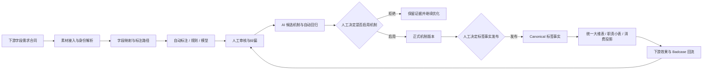

# TPENG 标签体系重构方案（业务宣讲版）

> 版本：v1.1（2026-08-16）
>
> 适用范围：TPENG 标签实验台（LabelLab）统一底座、3D/SU 首个真实闭环纵切
>
> 文档状态：非下游范围已由统一 Owner 确认；下游同步和真实执行证据待完成

## 一、背景与现状

### 1.1 业务背景

随着 3D、SU、灵感图、Proposal PDF 等多类目素材持续进入业务链路，标签已经不只是页面上的筛选字段，而是连接素材理解、质量评测、搜索消费和问题回流的共同事实层。下游消费形态也已经明确为统一大维表和数个职责小表，因此标签生产必须同时满足业务可用、版本可追溯和结果可对账。

### 1.2 当前现状

当前已经形成 **TPENG 标签实验台（LabelLab）** 的能力骨架：模型注册、类目评测机制、Prompt A/B 与 V3 合同、人工审核纠偏、AI 候选与回归、机制和标签事实双发布轴、存量回归/重跑、字段需求合同、资产身份与下游投影边界均已进入本地实现或确定性验证。

这些能力目前主要作为统一底座的本地实现与验证，真实数据窗口、真实模型调用、权限、下游目标表和生产回退仍需单独冻结，不把本地 fixture 或 dry-run 结果当作生产事实。

### 1.3 重构目标与边界

“标签体系重构”与“标签实验台”不再是两条项目线。标签体系重构是转型目标，LabelLab 是统一产品载体和标签/内容中台通用底座；业务类目只以 profile 和专用视图扩展差异，不复制平台通用能力。首个真实验证纵切是 2026 年 9 月的 3D/SU 闭环。

## 二、核心痛点

### 2.1 生产链路割裂

素材接入、字段映射、模型评测、人工纠偏、正式发布和下游使用缺少统一的任务、版本、证据和审计上下文，问题出现后难以定位是哪一批素材、哪套机制或哪个模型导致。

### 2.2 事实与消费策略混杂

搜索相关性、排序权重、知识图谱内部关系等消费策略如果直接回写标签，会造成事实主权不清、版本无法重建、下游结果无法对账，也会让中台被迫承担不属于资产事实的策略职责。

### 2.3 类目差异带来重复建设

3D、SU、灵感图和 Proposal PDF 的评测方式不同，但模型管理、任务调度、人工纠偏、候选机制、发布、重跑、投影和回流应当共享。若按类目各自建设，后续会形成多个模型中心、版本中心和发布中心。

### 2.4 人工与 AI 迭代缺少可控协同

人工纠偏需要证据和责任归属，AI 需要自动汇总样本、生成候选机制和执行回归；两者若没有明确的候选态、人工启用门和标签事实发布门，就会出现候选误生效或人工不知道下一步如何操作。

## 三、解决方案总览

### 3.1 统一产品载体

统一产品名称为 **TPENG 标签实验台（LabelLab）**。它不是单纯的评测、打分或提示词实验工具，而是承接“字段需求到标签消费和 Badcase 回流”的事实生产与治理闭环。业务类目使用“TPENG 标签实验台 · <类目>场景扩展”命名，不另建模型中心、纠偏中心、版本中心或发布中心。

### 3.2 一条完整业务闭环

平台以“下游字段需求合同 → 素材接入 → 标注路径/任务 → 自动与人工标注 → 纠偏验收 → 版本发布 → 下游引用/对账 → Badcase 回流”为主线，把生产、质量、发布和消费纳入同一条可追溯链路。

### 3.3 两条必须守住的边界

第一，`semantic.*`、`quality.*`、`governance.*`、人工真值、证据、来源、机制/模型/规则版本、审核和发布状态属于 Canonical 事实；搜索索引、知识图谱、向量索引和数据库表是可重建消费投影。

第二，机制候选启用和标签事实发布保持双人工门。人工点击启动纠偏分析后，系统自动汇总样本、调用调优模型、生成候选并执行回归；人工只在结果区决定启用/拒绝候选，以及是否发布正式标签事实。

### 3.4 第一条真实验证纵切

本阶段不追求一次覆盖所有类目，而是以 **3D/SU** 作为首个真实验证纵切，在 2026 年 9 月证明“标签可生产、事实可追溯、结果可消费、问题可回流”。验证通过后，其他类目只需新增 profile、字段适用性、评测机制、提示词、规则、阈值和专用视图，不再复制第二套平台。

## 四、方案细节：目标业务闭环

闭环的关键是：每一步都有任务上下文、版本、责任人、证据和回退点；任何候选机制或人工过程都不能被下游当成正式事实消费。

## 五、方案细节：平台架构与工作区

### 5.1 一个平台

所有类目共享统一的资产、任务、模型、机制、审核、质量、发布、投影和回流底座。

### 5.2 双工作区

| 工作区 | 适用任务 | 主线 | 关键差异 |
|---|---|---|---|
| 增量评测 | 新进入、未定性素材 | 类目 → 素材导入 → 评测包 → 机制 → 评测 → 人工纠偏 → AI 迭代 → 人工生效 | 目标是形成新标签事实 |
| 存量回归 | 已定性存量素材 | 类目 → 存量包 → 机制 → 回归 → 人工纠偏 → AI 迭代 → 人工生效 → 存量重跑 | 目标是验证或覆盖已有事实，但必须单独批准 |

两条链路共享平台内核，但页面、任务上下文和步骤指引隔离，避免把增量生产和存量覆盖混为一谈。

### 5.3 双发布轴

1. **机制发布轴**：候选机制 → 候选回归 → 人工启用或拒绝 → 现役机制。
2. **标签事实发布轴**：评测/纠偏结果 → 人工审核 → 正式标签事实 → 下游投影。

机制启用不等于标签事实自动发布，也不等于存量标签自动覆盖。存量重跑必须另行发起、另行验收、另行发布。

## 六、方案细节：Canonical 事实主权

### 6.1 什么是中台事实

以下内容属于 TPENG 标签实验台 Canonical 事实：

- `semantic.*`：空间、对象、风格、材质、结构特征等资产语义字段；
- `quality.*`：质量指标、字段级 Precision/Recall、五档矩阵、失败样本和对账结果；
- `governance.*`：来源、资产版本、机制/模型/规则版本、人工真值、审核和发布状态；
- 证据、来源哈希、审核记录、发布记录和回退记录。

这些事实必须能够定位到资产版本、机制版本和模型版本，并支持历史重建和责任追溯。

### 6.2 什么不是中台事实

以下内容属于下游策略或消费投影，不写入素材 Canonical 标签事实：

- Query×素材相关性；
- 搜索排序权重、多路召回融合和在线实验参数；
- 知识图谱内部实体关系、路径和图结构关系；
- 下游数据库表中的兼容别名或临时派生字段。

搜索索引、知识图谱、向量索引和数据库表都必须能够根据资产版本、机制版本和模型版本重建、失效、回退和对账。

## 七、方案细节：模型与评测机制管理

### 7.1 模型管理中心

模型管理采用列表型配置，区分两类模型：

| 模型类型 | 用途 | 管理内容 |
|---|---|---|
| 主模型 | 各类目正式评测和标注 | 协议、供应商、模型名、Token 配置引用、价格、调用上限、思考开关、层级、启用状态 |
| 调优模型 | AI 自动纠偏、机制候选生成和查漏补缺 | 同上，并额外绑定调优用途、候选产物版本和回归证据 |

模型协议以可插拔适配器支持行业内主流接口；平台只保存受控配置和引用，不在文档、日志或导出物中暴露 Token。

### 7.2 类目评测机制

每个类目可以维护多个 Prompt A/B、V3 合同、规则和机制版本，并区分：

- 现役版本；
- 候选版本；
- 非现役历史版本；
- 退役版本。

机制版本必须冻结输入合同、模型版本、提示词版本、规则版本和质量门槛。历史回归读取冻结快照，不被后续现役版本覆盖。

### 7.3 AI 迭代与人工门

人工点击“启动纠偏分析”后，系统自动完成样本汇总、调优模型分析、候选机制生成和样本回归；不再要求人工补充额外配置。

AI 只能生成候选机制和回归证据，不能自动启用。人工需要在统一结果区域查看：

- 纠偏分析结论；
- 候选机制差异；
- 回归指标；
- 风险提示；
- 失败样本和证据。

最终由具备权限的人工决定“启用候选”或“拒绝候选”。

## 八、方案细节：3D/SU 首个真实闭环纵切

### 8.1 9 月目标

在 2026 年 9 月内，至少完成 3D 和 SU 各一批真实素材的闭环验证：

1. 真实来源身份与去重通过；
2. whole/single 路径可识别；
3. 平台字段和 3D/SU 扩展字段完成自动/人工标注；
4. 评测机制、纠偏、AI 候选和自动回归可追溯；
5. 机制启用和标签事实发布分别通过人工门；
6. 正式事实进入统一大维表和职责小表投影；
7. 下游读取完成版本、数量、缺失和哈希对账；
8. 至少一次 Badcase 回流并形成下一轮纠偏证据。

### 8.2 前置负责人签认

真实接入前需要六类负责人分别签认：

| 负责人 | 需要签认的内容 |
|---|---|
| 产品/标签负责人 | 平台字段、类目扩展、业务优先级和双人工门 |
| 数据负责人 | 源表、数据窗口、身份键、重复/冲突结果和只读权限 |
| 算法负责人 | 模型/提示词/机制版本、回归门槛和 P/R 口径 |
| 审核负责人 | 黄金集真值、双人审核、争议裁决和样本复核 |
| 平台负责人 | 接入、队列、幂等、投影、对账和回退演练 |
| 下游消费负责人 | 大维表/小表字段映射、读取、对账和 Badcase 回流 |

未完成签认时，readiness 状态保持 `pending_external_signoff`，不能被解释为真实接入就绪。

## 九、方案细节：下游消费与投影

下游实际消费以数据库表为主，默认采用：

- **统一大维表**：承载稳定、通用、宽字段读取，适合详情、筛选和基础检索；
- **职责小表**：按搜索标签、质量过滤、治理来源、变更事件或类目专用字段拆分。

所有表只消费正式发布事实，不读取候选机制、实验结果或人工处理过程。每个投影必须携带：

- 资产主键和资产版本；
- 标签事实版本；
- 机制版本和模型版本；
- 幂等键；
- 生成时间、失效时间和回退点；
- 行数、缺失、版本匹配和哈希对账结果。

数据库表是消费投影，不是标签事实主库。表中发现的问题通过 Badcase 或对账差异回流中台，不直接反向修改 Canonical 事实。

## 十、方案细节：指标体系与验收口径

### 10.1 底座质量指标

- 字段级 Precision；
- 字段级 Recall；
- 结构化标签映射准确率；
- 冲突率、未映射率和人工纠偏率；
- 资产/标签/机制/模型版本对账通过率。

默认质量门槛为 Precision ≥ 80%、Recall ≥ 70%，降低门槛必须由 Owner 另行批准。

### 10.2 美感评测指标

原有五档矩阵继续保留，同时展示：

- 精确等级准确率；
- 相邻等级准确率；
- 推荐档 L1/L2 精确率与召回率；
- 常规档 L3/L4 精确率与召回率；
- 过滤档 L5 精确率与召回率。

### 10.3 消费效果指标

标签生产指标不能替代消费效果。首个真实消费场景建议优先选择 3D 搜索或筛选，至少观察：

- 召回覆盖、零结果率和命中率；
- 有效浏览、点击或筛选使用；
- 下游 Badcase 数量与回流闭环率；
- 线上字段版本、投影缺失和延迟。

Query 相关性和排序权重仍由搜索/推荐方负责，不写入标签事实。

## 十一、落地节奏：先证闭环，再扩平台

| 阶段 | 目标 | 主要产物 | 进入条件 |
|---|---|---|---|
| 前置签认 | 锁定身份、字段、样本、权限和责任 | readiness、字段签认、黄金集计划、RACI | 六类负责人签认 |
| 9 月 3D/SU 纵切 | 跑通真实增量闭环和一次存量验证 | 真实运行回执、P/R、投影对账、Badcase | 真实来源和样本可用 |
| 下一阶段平台化 | 把验证结果沉淀为通用字段、资产版本和投影能力 | 字段注册/Canonical 事实/投影 registry | Owner 单独冻结范围 |
| 多类目扩展 | 灵感图、Proposal PDF、SU/3D 专用视图等扩展 | profile、机制、视图和类目回归 | 复用底座，不复制平台 |
| 消费闭环优化 | 结合下游效果持续调整标准 | 消费效果、回流、版本升级 | 下游 Owner 参与验收 |

## 十二、范围边界：当前不做什么

本方案不自动授权以下工作：

- 连接真实上游或执行 DataWorks/ODPS SQL；
- 申请或读取真实权限、Token 或生产密钥；
- 批量调用真实模型；
- 写入统一大维表或职责小表；
- 自动启用候选机制、自动发布标签或自动覆盖存量；
- 实现生产级多实例投影 Worker、Embedding 全生命周期或全量存量 Worker；
- 把搜索、知识图谱、向量索引建设量当作标签重构成功标准；
- 因产品定位合并而返工已经完成的 LabelLab 实现。

## 十三、需要业务方本次拍板的事项

1. 是否认可 TPENG 标签实验台作为标签体系重构的统一产品载体和中台底座？
2. 是否认可 3D/SU 作为 2026 年 9 月首个真实闭环纵切？
3. 是否确认平台通用字段与 3D/SU 扩展字段的边界？
4. 是否指定六类负责人并完成身份、字段、黄金集、权限、投影和消费验收签认？
5. 是否确认下游以统一大维表 + 数张职责小表作为第一阶段消费形态？
6. 是否同意将字段 Precision/Recall、版本对账和 Badcase 回流纳入首期验收？
7. 对于下一阶段 Gap，是否由 Owner 单独冻结范围、权限、回退和验收，而不是在本轮自动扩张？

## 十四、对业务方的一句话

我们不是再做一个评测工具，而是在建设一个可持续生产、审核、发布、消费和回流标签事实的统一底座；3D/SU 是第一条真实验证链路，成功标准是闭环证据和下游效果，而不是页面数量或模型调用次数。

## 附录：当前证据索引

- 统一产品载体：`docs/decisions/0042-unified-labellab-product-carrier.md`
- Canonical 事实和投影边界：`docs/decisions/0043-canonical-facts-and-semantic-projection-boundaries.md`
- 双工作区与表投影：`docs/decisions/0045-dual-workspaces-and-table-projection-contract.md`
- 平台级语义字段合同：`docs/decisions/0047-platform-semantic-tag-demand-contract.md`
- 平台能力 Gap：`docs/discussion/tpeng-platform-capability-map-and-gaps-20260811.md`
- 下一阶段 Gap：`docs/discussion/tpeng-labellab-gap-register-20260813.md`
- 3D/SU readiness：`docs/contracts/3d-su-readiness-freeze-v1.md`
