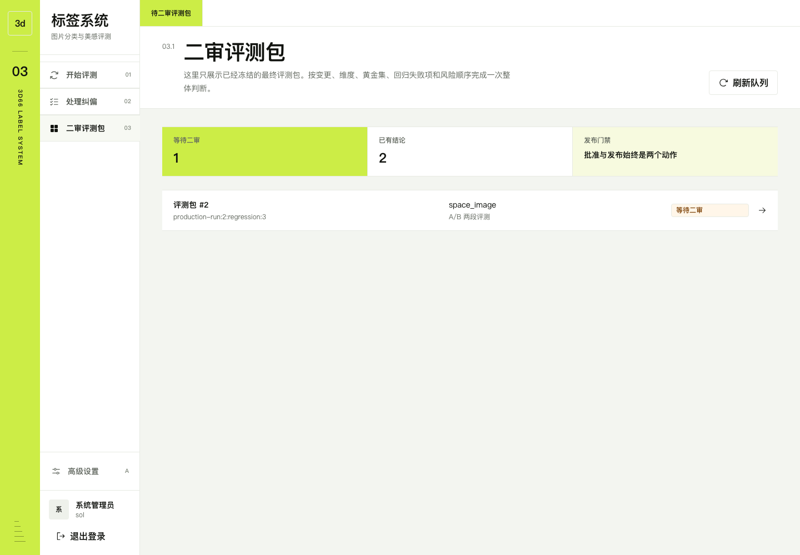
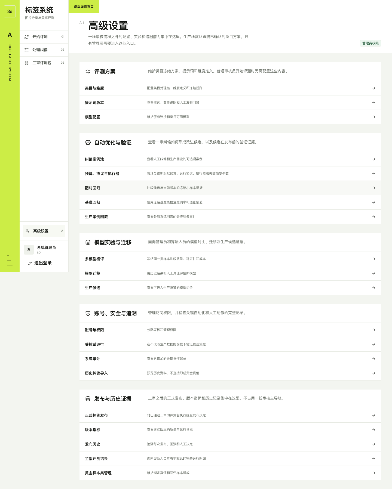
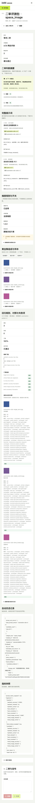

# 3d66 标签系统操作手册

> 适用版本：2026-08-02 评测包主线版  
> 适用角色：一线审核员、二审管理员、系统管理员

## 1. 日常工作主线

一线审核员只需要沿左侧三个入口工作：

1. **开始评测**：导入或整理素材，选择素材包与类目后启动评测。
2. **处理纠偏**：只处理系统分配的待审结果，提交最终人工判断。
3. **二审评测包**：管理员核对新版提示词、维度、黄金集和回归证据，决定批准或拒绝。

模型渠道、预算、执行器、协议和类目流水线统一放在**高级设置**，日常审核不需要修改。

## 2. 导入素材并开始评测

1. 打开**开始评测**，点击**导入或整理素材**。
2. 选择评测类目：空间图片、PDF 文本、材质图或管理员创建的其他类目。
3. 上传文件或选择现有素材，整理成素材包。
4. 返回评测包生产线，选择素材包和类目。
5. 确认“素材包可用、类目队列已开启、类目方案可冻结”三项检查通过。
6. 点击**开始评测**。重复点击不会重复创建同一轮任务。

支持的首期输入：

- 空间图片：JPG、PNG、WebP、GIF；GIF 会抽取关键帧评测，原动图仍保留展示。
- PDF 文本：提取正文，必要时 OCR，生成页图和多模态总结后再评测。
- 材质图：使用独立类目 Prompt、维度和材质专项上下文。

页面会持续显示当前阶段：进入队列、模型评测、一审纠偏、自动改进、黄金集回归、
最终包二审、人工发布。离开页面不会中断任务。

## 3. 处理人工纠偏

1. 打开**处理纠偏**。
2. 进入待审结果，查看模型等级、置信度、维度明细、画质封顶和评测理由。
3. 判断正确时提交确认；判断错误时选择错误字段、填写人工值与原因。
4. 同一素材形成新的最终真值时，系统更新黄金样本并保留历史修订，不会产生重复样本。
5. 完成当前批次后，系统自动组批、优化并运行配对回归；审核员不需要手动选择模型或预算。

## 4. 二审评测包

二审队列只显示已经冻结且具备回归证据的最终评测包。

进入详情后按以下顺序判断：

1. **阻塞与风险**：有阻塞时不得批准；风险项必须逐条确认。
2. **完整提示词**：核对 A/B 或单提示词全文、版本、Rubric 和变更说明。
3. **维度规则**：核对开关、范围、版本、权重和等级锚点。仅提示词评测会明确显示
   “维度评测已关闭”，不能把缺少维度误判为结果不完整。
4. **黄金集**：核对目标错例、稳定对照、盲测样本的数量和逐样本人工真值。
5. **回归结果**：先看失败项，再看基线/候选差异、指标门槛和全部门禁检查。
6. **自动改进记录**：确认候选来源、费用、关联回归以及“不会自动发布”。
7. 填写决定说明，选择**批准**或**拒绝**。

### 批准、发布和拒绝

- **批准**：只表示二审证据通过，不改变现役 Prompt、维度或类目基线。
- **发布**：管理员在批准后单独执行，才会原子切换该类目的现役评测方案。
- **拒绝**：保留完整证据，系统可继续收集纠偏并生成下一版包。
- 若批准后类目配置已经变化，发布会返回冲突并要求重新回归，旧包不能覆盖新基线。

## 5. 高级设置

仅系统管理员进入**高级设置**维护：

- 主评测、PDF 总结、提示词优化、横评与诊断模型；支持任意 OpenAI-compatible 渠道。
- 类目输入类型、允许格式、处理模块、单提示词/A-B 模式、维度与模型节点。
- 自动优化门槛、预算、冷却、租约和 Worker 状态。
- 已发布维度方案、提示词、黄金集和基线 Bundle。

### 5.1 管理类目维度

1. 打开**高级设置 → 维度管理器**，先选择要修改的类目。
2. 选择该类目的维度评测方式：
   - **全部维度**：执行绑定方案中的全部维度；
   - **选择维度**：只执行勾选的维度，可用于局部指标实验；
   - **仅提示词**：关闭维度评测，只观察提示词直接判断的质量表现。
3. 需要增加、删除、重排或修改维度时，新建一个维度方案草稿；填写稳定标识、名称、
   权重和等级锚点后保存。已发布方案不能原地修改。
4. 把草稿完善并通过校验后发布，再将类目绑定到该版本。保存类目配置只影响之后创建
   的任务，历史任务仍使用入队时冻结的版本和维度集合。
5. `选择维度` 至少保留一项；选择的维度必须属于当前绑定方案。类目之间互相隔离，
   修改空间图片不会改变 PDF 文本或材质图。

版本管理区会同时列出草稿、候选、已发布和已停用版本。已发布版本保持只读；需要调整时
先复制为草稿，完成增删、排序、权重和等级锚点编辑后再发布、绑定。

> 仅提示词评测用于实验对照。该模式不产生逐维评分和逐维纠偏，因此不要把它当作
> 已完成维度校准的正式替代方案。

活动类目必须绑定完整、已发布且当前 Worker 可执行的维度合同。固定单提示词类目只能
执行单提示词，固定 A/B 类目必须同时具备 A 与 B，合同不一致会在入队前阻止运行。

## 6. 常见状态与处理

| 状态 | 含义 | 操作 |
|---|---|---|
| 可以开始 | 素材包、类目和冻结方案完整 | 点击开始评测 |
| 等待一审 | 有结果需要人工判断 | 进入处理纠偏 |
| 自动改进中 | 系统正在组批、优化或回归 | 无需手动操作 |
| 等待二审 | 最终评测包已冻结 | 管理员进入二审 |
| Worker 未启动 | 后台执行器没有有效心跳或租约 | 管理员检查启动方式和 Worker 日志 |
| 模型未配置 | 任务冻结模型缺少可用凭据 | 管理员在高级设置保存并测试连接 |
| 预算不足 | 当日预算未设置或已耗尽 | 管理员调整预算或等待下一周期 |
| 维度合同不可执行 | 维度未发布、损坏或当前 Bundle 不支持 | 管理员重新选择已发布版本 |
| 发布冲突 | 二审后类目基线发生变化 | 重新生成回归，不覆盖新基线 |

## 7. 移动端

手机端使用同一流程，导航折叠到顶部菜单。二审长文本会自动换行或在局部区域滚动，
不会遮挡后续内容。正式发布仍建议在桌面端完成，便于并排核对全部证据。

## 8. 安全与异常处理

- API Key 保存后只显示掩码，数据库不保存明文；Windows 使用 DPAPI，Docker 使用文件 AEAD。
- 不要把密码、API Key、数据库、主密钥或登录 Cookie 发到聊天、Git 或共享文档。
- 模型超时、5xx、无 usage、Worker 重启和租约过期会进入受控重试或明确失败，不要重复导入素材。
- 任何自动优化都不能越过二审和显式发布门禁。
- 若页面状态与实际任务不一致，先点击刷新；仍异常时记录运行编号并联系管理员查看审计与 Worker 日志。
