# 标签实验台用户操作手册

> 适用版本：2026-08-03 多类目与存量回归版（`ceb2dbc`）
> 适用人员：一线审核员、二审负责人、回归测试人员、系统管理员
> 使用原则：普通审核员只走四个一级入口；模型、预算、协议、执行器和类目配置统一由管理员维护。

## 1. 先判断要走哪条流水线

系统首页左侧有四个日常入口：

1. **开始评测**：处理还没有人工定性的新增素材。
2. **存量回归**：用已经定性的存量素材检查当前策略是否准确。
3. **处理纠偏**：审核模型结果并沉淀人工真值。
4. **二审评测包**：整体核对新版 Prompt、维度、黄金集和回归证据。

两条流水线不能混用：

| 业务情况 | 使用入口 | 最终产物 |
|---|---|---|
| 新素材还没有 L1-L5 人工结论 | 开始评测 | 评测结果、人工真值、黄金样本、最终评测包 |
| 存量素材已经有 L1-L5 结论 | 存量回归 | 准确率报告、差异样本、专项优化建议 |

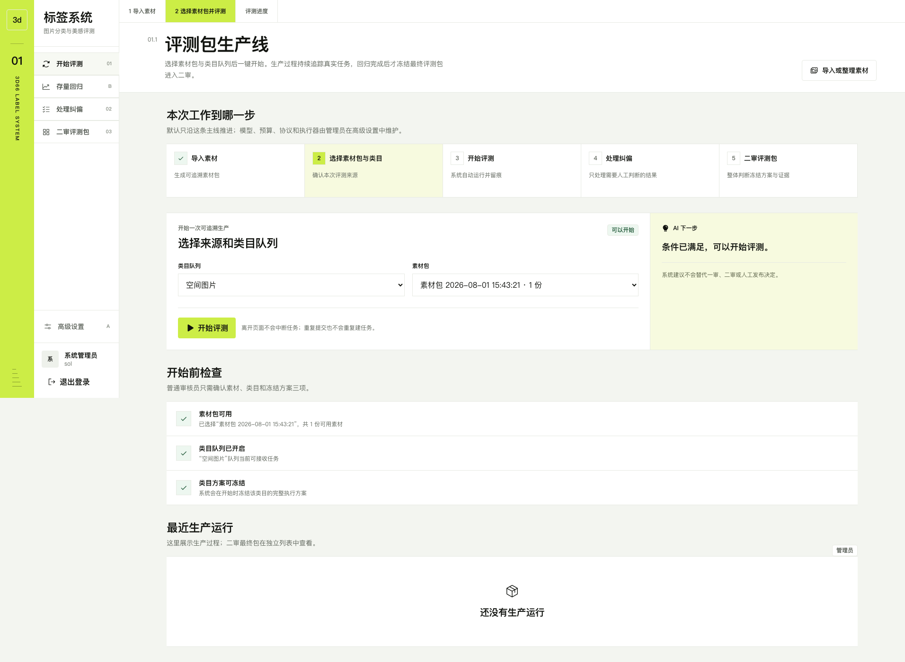

## 2. 登录、账号与权限

1. 使用分配给自己的账号登录，不共用管理员账号。
2. 审核员可导入素材、启动评测并处理纠偏。
3. 二审负责人可审查最终评测包。
4. 管理员才可配置模型、类目、维度、账号、预算和发布。
5. 页面没有显示某个按钮时，先确认账号角色，不要通过改地址或接口绕过权限。

账号停用、角色调整和密码重置都在**高级设置 → 账号与权限**完成。密码框留空代表不重置；新密码必须满足页面提示的长度要求。

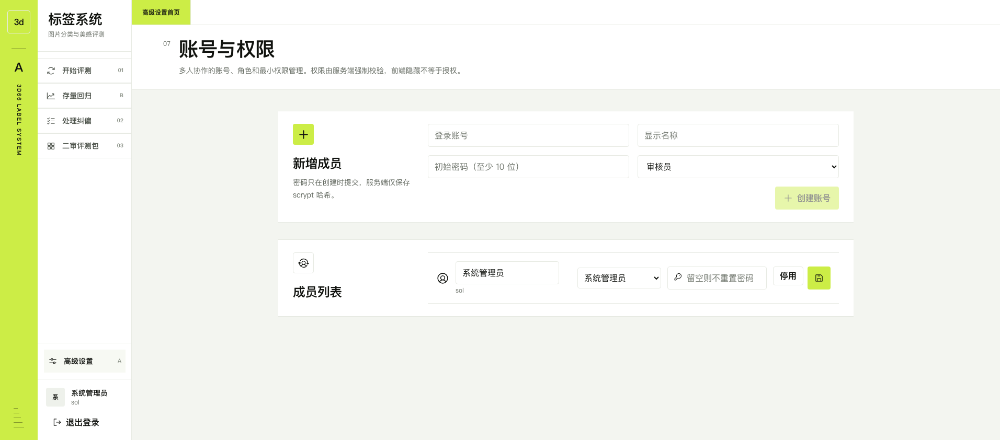

# 一、常规完整流水线

## 3. 上传并整理素材包

### 3.1 什么时候做

收到一批尚未定性的空间图、GIF、PDF 方案文本或材质图时，先进入**开始评测 → 1 导入素材**。

### 3.2 怎么操作

1. 先选择评测类目，再选择文件。上传控件会按类目限制可选格式。
2. 确认素材名称、数量和缩略图后创建素材包。
3. 一个素材包只能属于一个类目；类目选错时重新建包，不要在运行后改类目。
4. 重复文件会按现有去重规则复用，不需要反复上传。
5. 需要删除单张素材时使用页面删除入口；已被历史任务引用的素材只做逻辑删除，历史证据仍保留。
6. 上传文件夹时，`Thumbs.db`、隐藏文件、文本、快捷方式等非标准文件会被跳过；符合当前类目格式的文件继续上传，不会因为一个无关文件整批失败。
7. 格式正确但内容损坏的文件会列入“失败”，其余有效文件仍会进入素材包。处理完成后展开“成功 / 跳过 / 失败”清单逐项核对。
8. 如果整批没有任何有效文件，系统才会阻止创建素材包。ZIP 里的普通非标准文件同样会跳过，但路径穿越、加密文件、异常压缩比等安全风险仍会整包拒绝。

首期支持：

- 空间图片：JPG、PNG、WebP。
- 动图：GIF；系统抽取代表帧评测，原动图继续保留。
- PDF 文本：先提取正文，必要时 OCR，再生成页图和多模态摘要。
- 材质图：走独立的材质图 Prompt、维度和类目流水线。

### 3.3 完成标准

- 素材包名称、类目、素材数正确。
- 成功、跳过、失败数量与文件清单已经核对；失败文件已修复后单独补传。
- 素材包状态可用于后续评测。

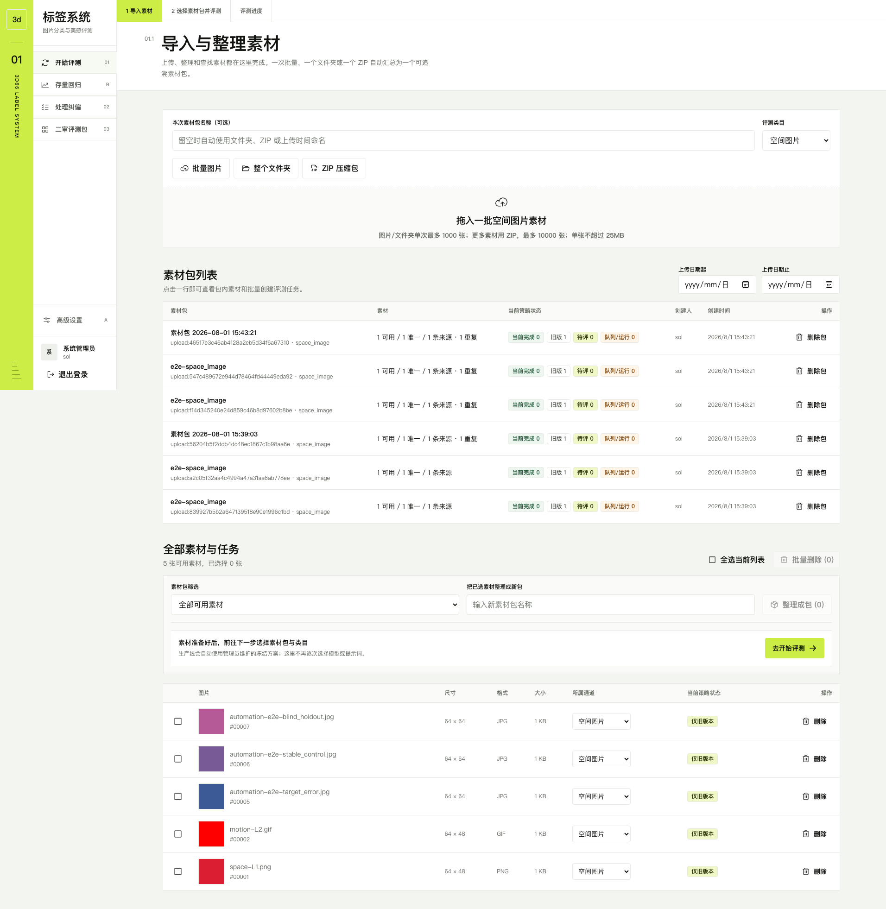

## 4. 选择素材包并开始评测

进入**开始评测 → 2 选择素材包并评测**：

1. 选择类目。
2. 选择刚创建的素材包。
3. 检查“素材包可用、类目队列已开启、类目方案可冻结”三项。
4. 全部通过后点击**开始评测**。

系统会自动完成：

`任务创建 → 模型评测 → 待审筛选 → 人工纠偏 → 自动改进 → 配对回归 → 最终评测包`

重复点击同一请求不会重复创建任务。离开页面也不会中断 Worker。

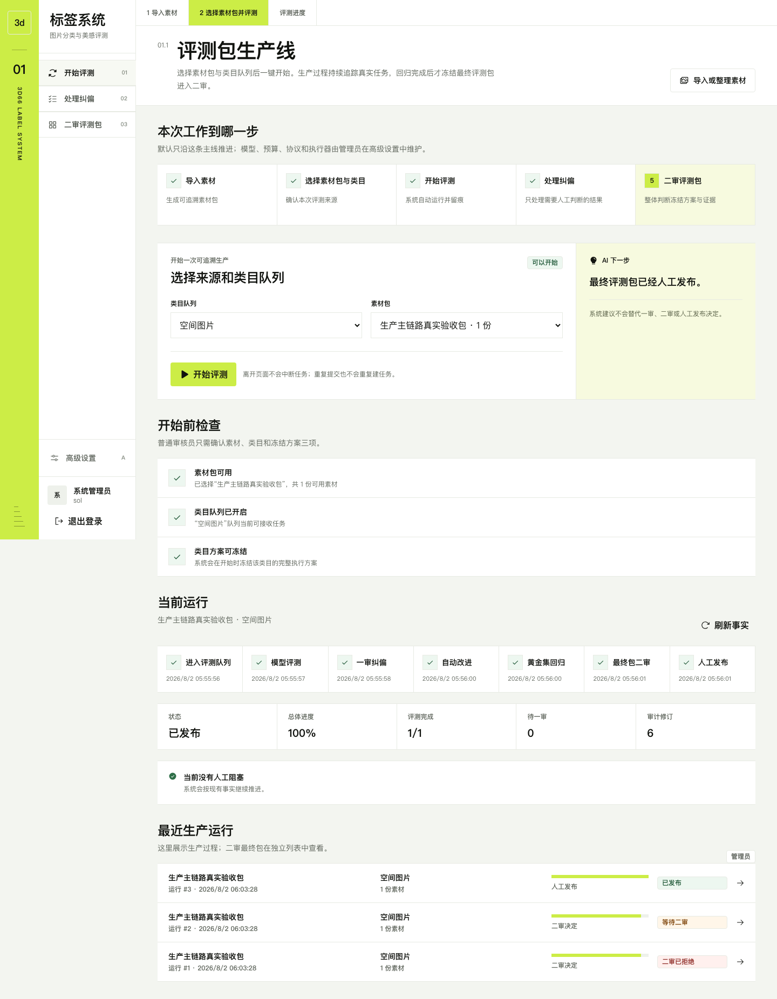

## 5. 查看评测进度

进入**开始评测 → 评测进度**：

- **排队中 / 运行中**：等待 Worker 处理，不要重复建任务。
- **待处理纠偏**：进入“处理纠偏”。
- **等待二审**：进入“二审评测包”。
- **失败**：记录任务编号和失败原因，由管理员检查 Worker、模型连接和冻结等级规则。

模型超时或 Worker 重启会按受控重试规则处理。页面长时间不变时先刷新事实，不要直接修改数据库。

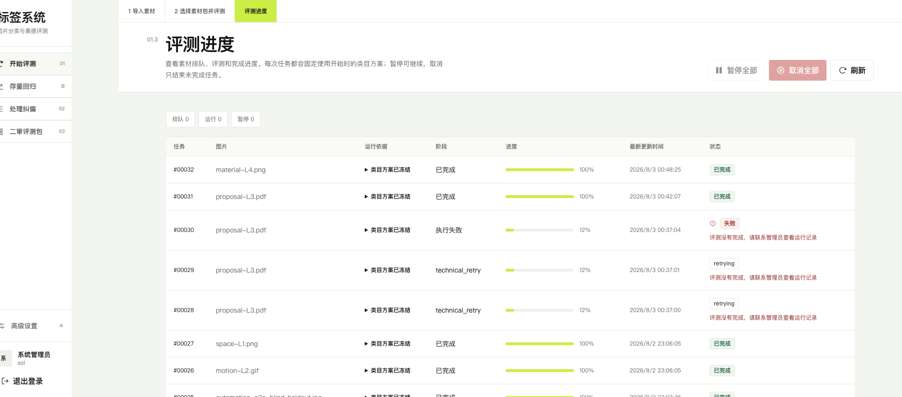

## 6. 审核员确认或纠偏

进入**处理纠偏 → 待处理纠偏**，按以下顺序核对：

1. 素材是否与结果对应。
2. 最终等级与分数。
3. 分类、画质和封顶原因。
4. 逐维证据、缺陷和置信度。
5. 模型给出的评测理由。

### 6.1 模型结果正确

确认所有关键字段后提交确认。

### 6.2 模型结果错误

1. 修改最终等级或错误字段。
2. 选择至少一个纠偏原因。
3. 写清可复用的判断依据，不写“感觉不对”这类无法复用的说明。
4. 核对重新计算后的结果，再提交纠偏。

### 6.3 暂时无法判断

填写疑点并退回复核。不要为了清空队列随意给等级。

### 6.4 仅提示词结果

仅提示词模式不会产生逐维分数，也不能做逐维纠偏；页面会显示 `formal=false`、`experimental=true`。这是实验结果，不是维度校准完成的正式结果。

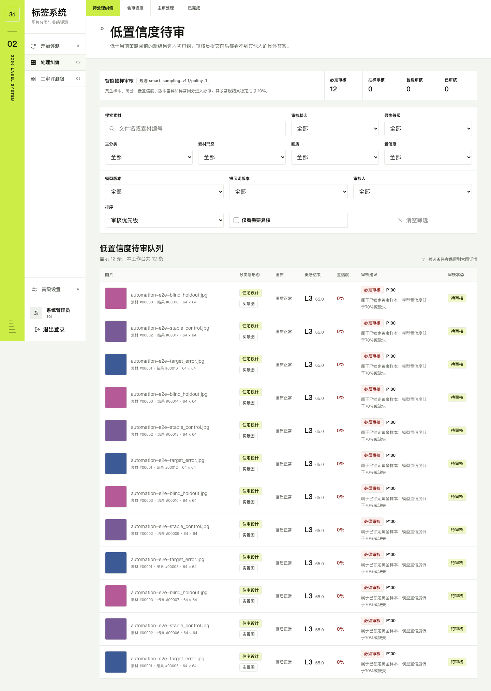

## 7. 会审、主审与完成状态

- 多人审核任务会进入**会审进度**。
- 意见冲突或无法自动形成真值时进入**主审处理**。
- 已结算任务进入**已完成**，并保留完整修订历史。
- 同一素材形成新人工真值时增加修订，不重复制造两条黄金样本。

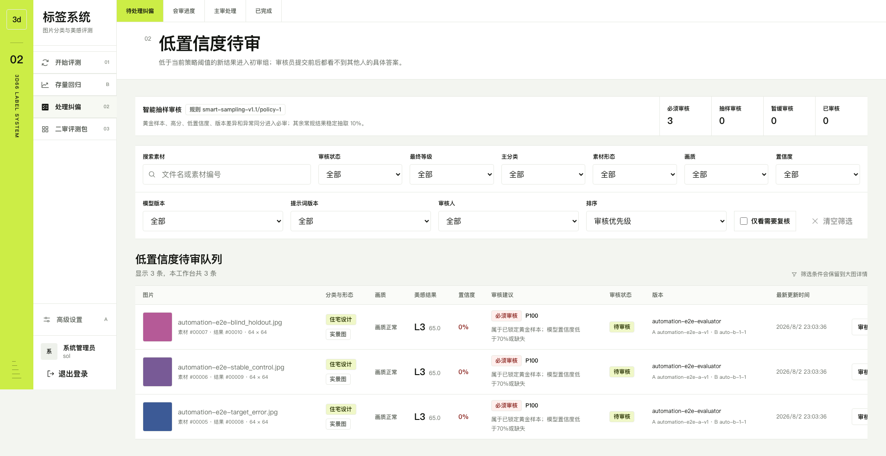

## 8. 二审最终评测包

进入**二审评测包**。列表只显示已经冻结、可以整体判断的包。

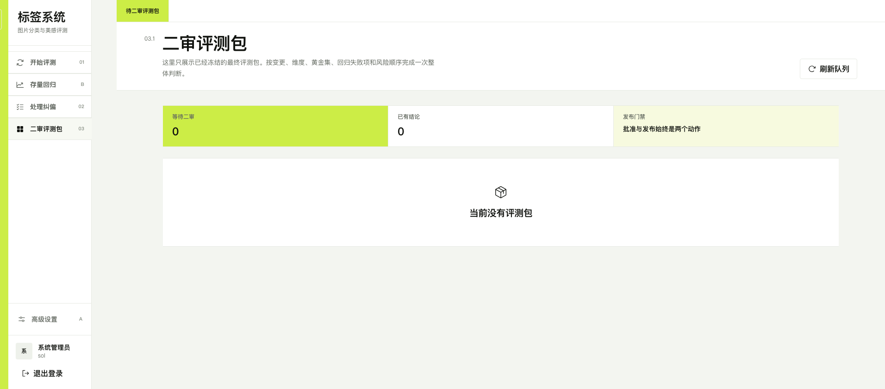

打开详情后必须从上到下检查：

1. **二审判断摘要**：先看阻塞和风险。
2. **完整提示词**：核对单提示词或 A/B 全文、版本、Rubric 和变更说明。
3. **维度规则与开关**：核对范围、Schema 版本、权重和等级锚点。
4. **黄金样本集**：核对目标错例、稳定对照、盲测样本和逐样本真值。
5. **回归规则与失败项**：先看失败，再看候选与基线差异。
6. **自动改进记录**：确认来源、费用、关联回归和不可自动发布声明。
7. **身份与版本**：确认模型、规则、引擎和候选策略身份一致。

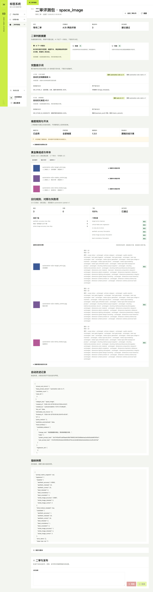

### 8.1 批准、拒绝和发布

- **批准**：只代表证据通过，不切换现役方案。
- **拒绝**：保留全部证据，等待下一版候选。
- **发布**：管理员在批准后单独执行，才会原子切换该类目的基线。
- 若二审后类目配置已经变化，发布会返回冲突，必须重新回归。

# 二、存量基准回归流水线

## 9. 创建基准素材和冻结基准集

“存量回归”用于已经定性的素材，不进入完整的一审、二审定性流程。

1. 进入**存量回归**，先选择类目。
2. 上传基准素材或从现有素材包选择。
3. 给每张素材确认 L1-L5 期望等级。
4. 文件名中的 L1-L5 或中文等级只用于预填，创建前仍需人工确认。
5. 填写基准集名称并创建。冻结后不可原地修改。

Prompt、素材包、基准集、运行和纠偏分析都按类目隔离，不能把空间图 Prompt 用到 PDF 或材质图。

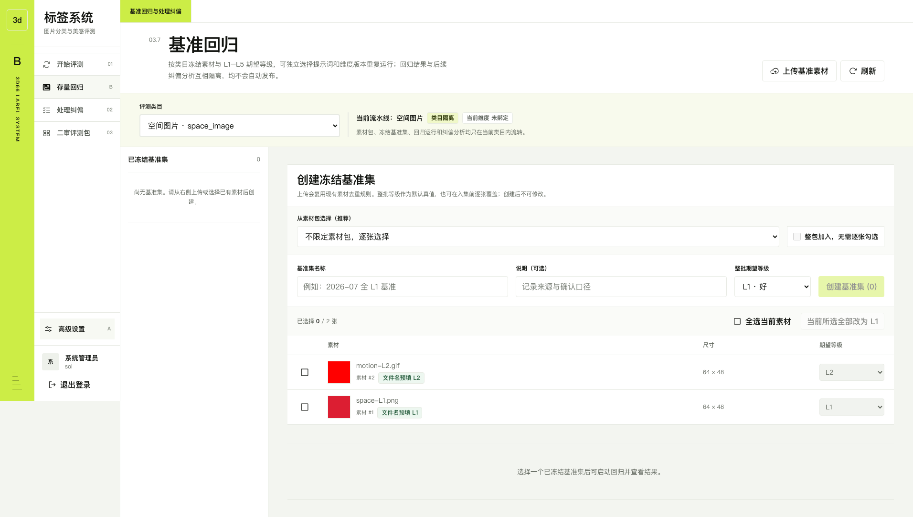

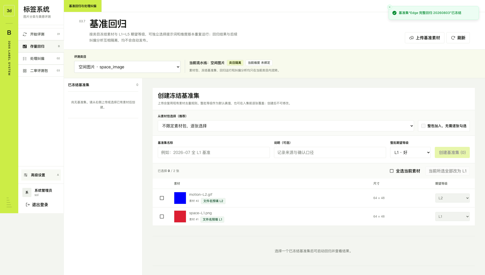

## 10. 选择单提示词或 A/B 模式

创建运行前核对：

1. 提示词取值方式：跟随类目、手动选择或固定类目版本。
2. 提示词调用模式：单提示词或 A/B 两段。
3. 维度方式：全部维度、选择部分维度或仅提示词。
4. 维度 Schema 版本。

固定单提示词类目会自动隐藏 B 调用。PDF 文本和材质图没有专属已发布维度方案时，会明确显示“维度已关闭”，不会借用空间图八维。

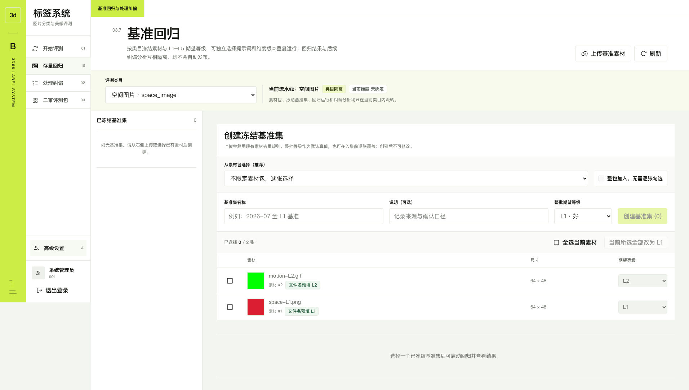

## 11. 查看回归结果和判断信息

运行完成后重点看：

1. 总体准确率。
2. 相邻等级准确率。
3. L1-L5 混淆矩阵。
4. 逐张期望等级与预测等级。
5. 权威分数、封顶原因、维度强弱项和评测理由。
6. 差异样本的错误方向和影响范围。

总体准确率不能单独决定是否发布。小样本 100% 只能说明当前样本全部命中，不代表所有生产素材已经稳定。

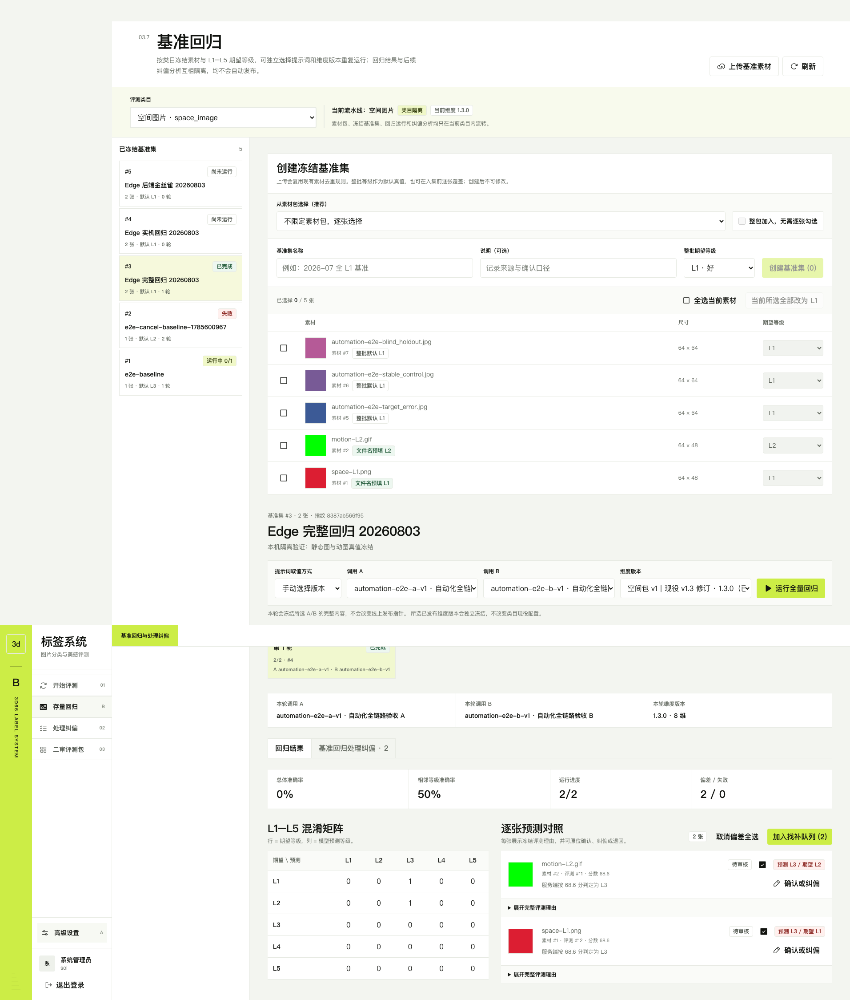

## 12. 基准回归处理纠偏

对差异样本创建纠偏分析后，系统会生成：

- 准确性摘要。
- 差异归因。
- Prompt、维度或素材真值的建议。
- 优化优先级和风险说明。

这些建议不会自动修改或发布现役策略。确认真值后，可把有效差异样本加入优化案例池，再创建候选 Prompt 和配对回归。

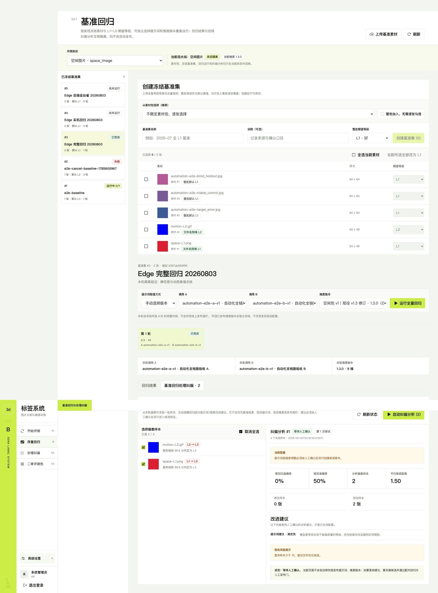

## 13. PDF 文本与材质图回归

### 13.1 PDF 文本

PDF 会先执行正文提取、必要 OCR、页图生成和多模态总结，再进入单提示词评测。上传前确认文件不是加密 PDF，页数和大小符合类目限制。

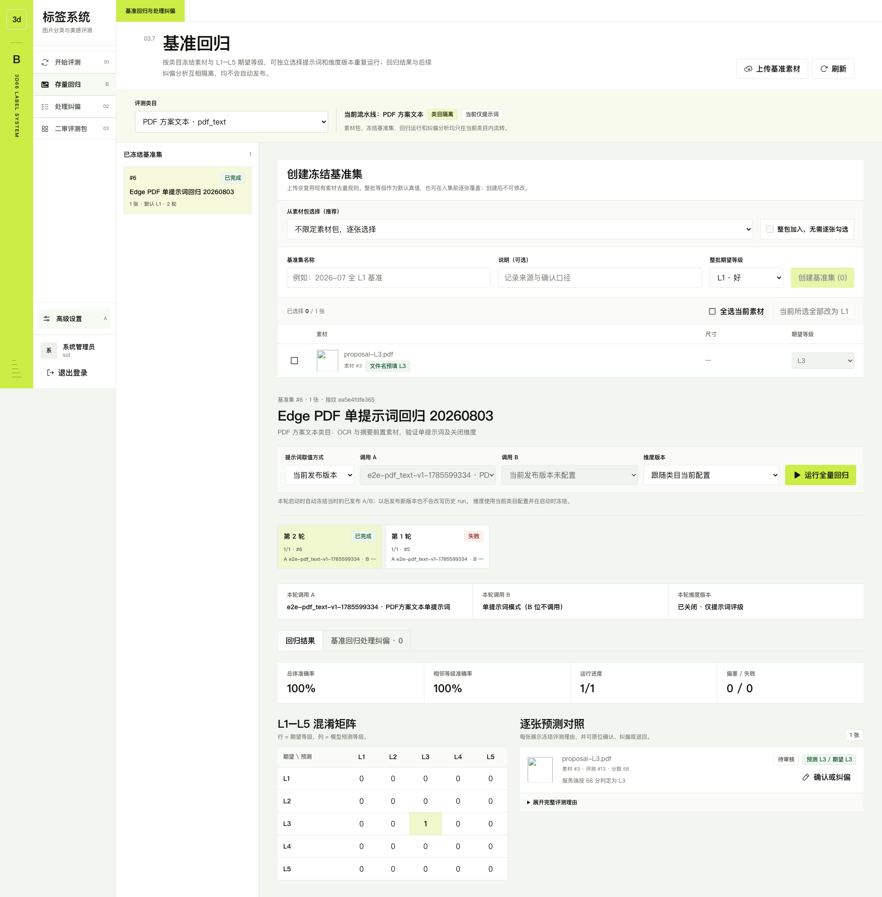

### 13.2 材质图

材质图使用独立 Prompt 和类目等级规则。仅提示词实验结果不生成空间图片八维，也不进入逐维纠偏。

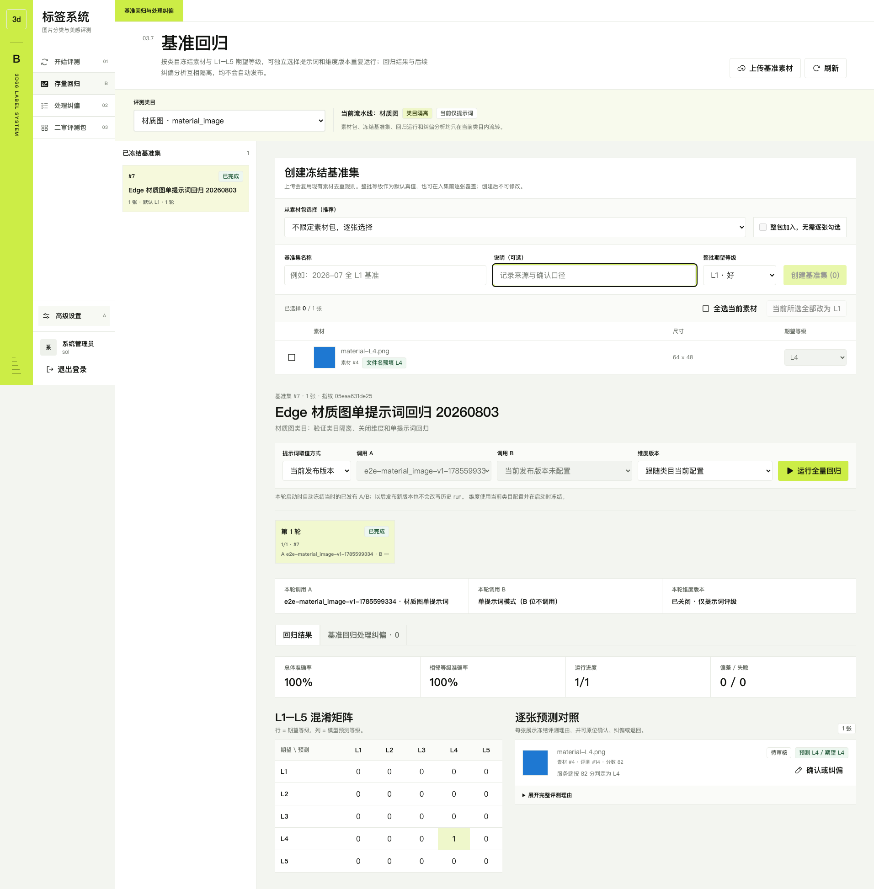

# 三、管理员高级设置

## 14. 高级设置首页

高级设置集中放置非日常能力：类目与维度、提示词、模型、案例池、预算与执行器、配对回归、横评、账号权限、审计和正式标签发布。

普通审核员不要修改这些配置。管理员每次改动都应先在隔离样本验证，再生成二审评测包。

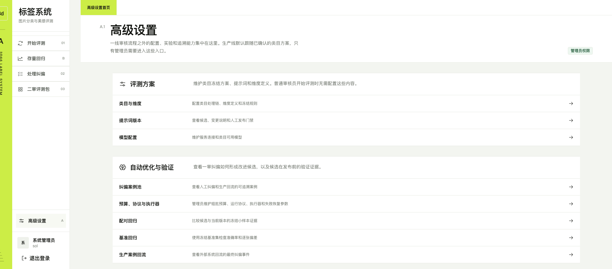

## 15. 类目与维度管理

### 15.1 选择维度模式

1. 进入**高级设置 → 类目与维度**。
2. 选择类目。
3. 选择：
   - **全部维度**：执行已绑定方案的全部维度。
   - **选择维度**：只执行勾选的重点维度。
   - **仅提示词**：关闭维度评测，只观察模型直出质量。
4. 保存后只影响之后创建的任务，历史任务继续使用冻结快照。

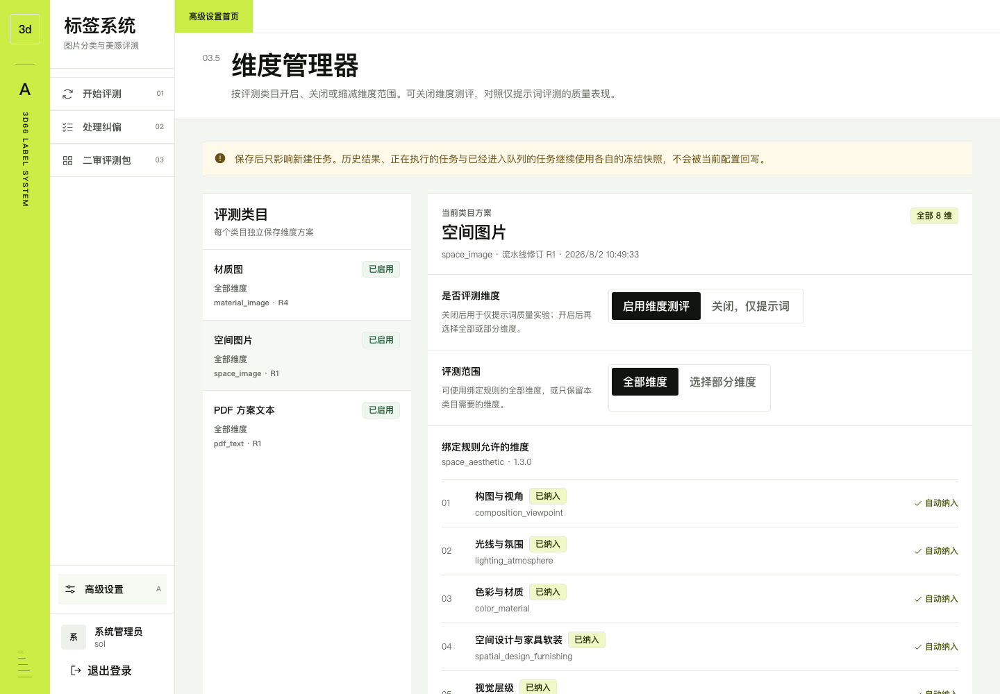

### 15.2 管理 Schema 版本

1. 需要从零设计时点击**新建空白方案**；需要沿用现有规则时，对已发布版本点击**复制为新草稿**。
2. 在草稿中可以手动新增全新维度，并编辑中文名、稳定 key、评审说明、权重和 1-5 级评分锚点。
3. 使用上移、下移调整展示与输出顺序；不再需要的维度可从草稿中删除。类目只启用部分维度时，在上方“选择维度”模式勾选生效范围。
4. 同一方案内 key 不能重复；key 发布后作为稳定身份使用，不要换名复用。中文名、评审说明、五级锚点均必填，全部计分维度权重合计必须为 100%。
5. 保存草稿不会影响现役任务。校验通过后发布，再把该版本绑定到目标类目；历史任务继续使用入队时冻结的旧 Schema 和维度集合。
6. 已发布和已退役版本不可原地修改或删除。活动类目只能绑定完整、已发布且 Worker 可执行的等级规则。

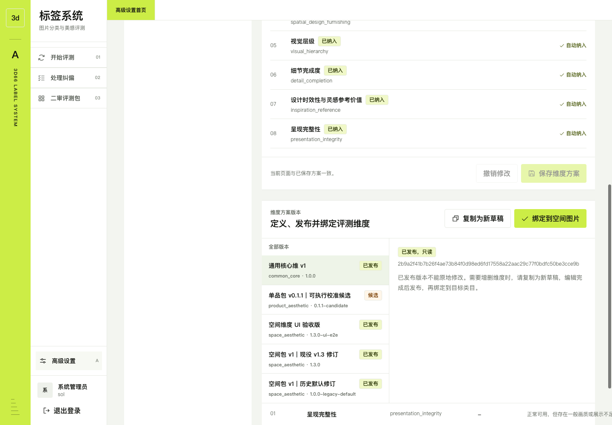

## 16. 模型、渠道和类目流水线

进入**高级设置 → 模型配置**：

1. 维护主评测、PDF 总结、提示词优化、横评和诊断模型。
2. 支持 OpenAI Chat Completions、OpenAI Responses、Anthropic Messages 和自定义 JSON 协议。
3. 可配置火山、OpenAI-compatible、DeepSeek 或其他兼容渠道，不锁死豆包或 Sol。
4. API Key 保存后只显示安全状态，不在数据库或页面回显明文。
5. 先保存配置，再执行连接测试；失败时检查 Base URL、API 路径、协议和模型 ID。
6. 在类目配置中绑定主模型、提示词模式、允许格式、处理模块和维度方式。

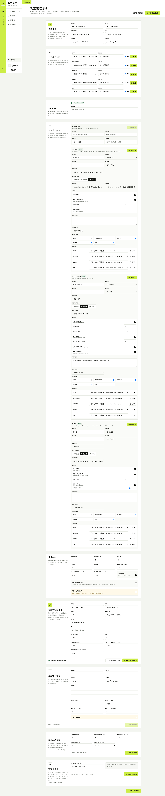

## 17. 候选 Prompt、自动优化与配对回归

### 17.1 提示词版本管理

进入“候选提示词”后，依次选择类目、完整流水线/基准回归和调用 A/B。版本列表只展示
当前层级下的内容，并用“草稿”“已发布”“当前启用”区分生命周期。每个版本都有明确的
流水线归属：完整流水线专用、基准回归专用，或两条流水线共用。服务端会按类目和归属过滤，
所以完整流水线专用版本不会出现在基准回归选择器中。

草稿编辑后点击“保存当前版本”会原地保存当前草稿内容，不会产生新版本；需要保留原内容并
创建新版本时使用“另存为草稿”。已发布版本和已经被任务冻结的版本不可原地修改。发布时选择
目标流水线归属；删除操作是软归档，历史任务仍可读取冻结快照，但归档版本不会出现在新任务选择器。

基准回归页面的手动提示词选择同时包含草稿和已发布版本，且只允许基准回归专用/共用版本。
草稿会在创建 run 时冻结到策略快照，后续继续编辑不会影响本次全量回归。

人工纠偏或基准差异进入案例池后：

1. 系统或管理员创建候选 Prompt 草稿。
2. 检查变更说明和完整提示词。
3. 使用冻结小样本运行配对回归。
4. 查看完成数、通过率、系统建议和逐样本对照。
5. 人工批准候选后，再进入最终评测包；任何自动优化都不能直接发布。

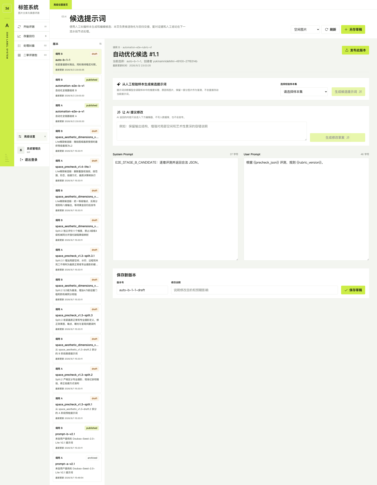

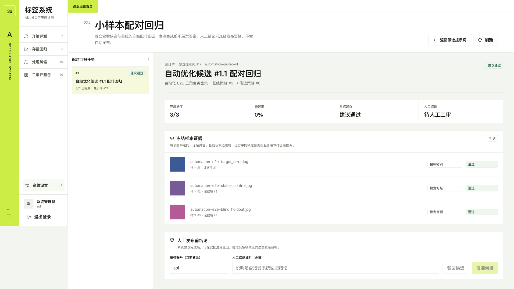

## 18. 正式标签、导出与下游使用

评测包发布只改变未来任务使用的策略基线；正式标签发布才改变下游读取的标签事实，两者不能混用。

管理员在**高级设置 → 正式标签发布**完成：

1. 选择已通过二审的来源。
2. 核对发布范围、版本和影响数量。
3. 显式发布后记录审计、Outbox 和下游游标。
4. 需要回退时选择明确历史版本，不对当前版本做无意义回滚。
5. 手工导出前核对类目、版本、时间范围和文件格式。

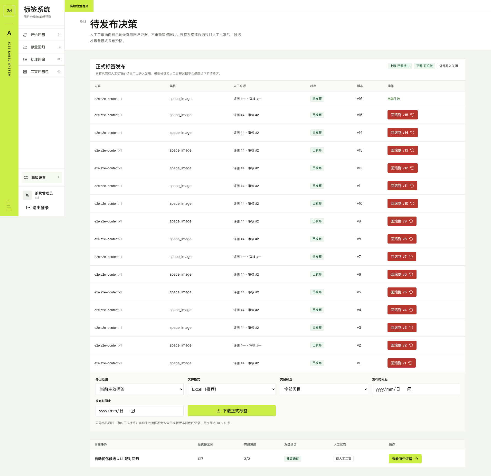

## 19. 系统审计

账号变更、Prompt/维度发布、评测包决定、正式标签发布和回滚都会进入只追加审计。排查问题时按时间、操作者、对象和修订号核对，不删除历史记录。

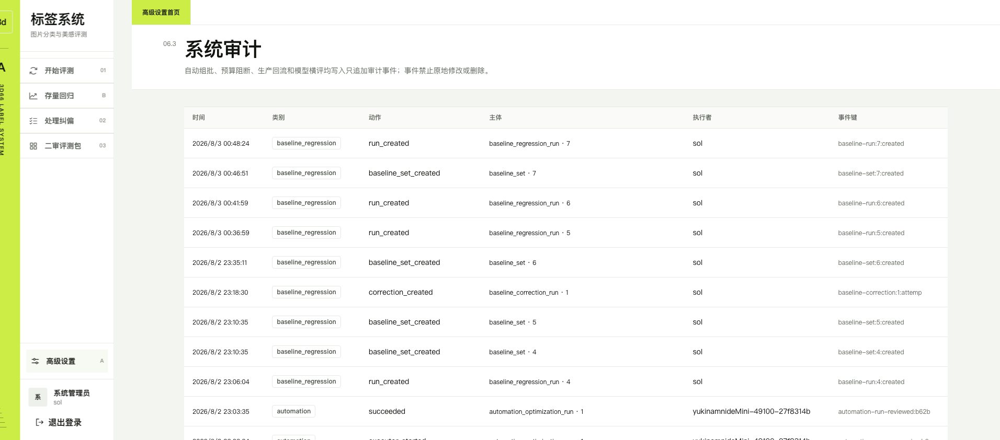

# 四、移动端、部署与排障

## 20. 移动端

手机端导航收进顶部菜单。长证据按单列展示，混淆矩阵只在自身区域横向滚动，不应造成整页溢出。正式发布仍建议使用桌面端，便于并排核对全部证据。

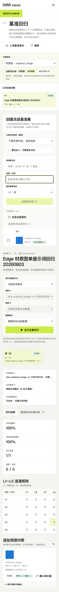

## 21. 服务启动与日常检查

### 21.1 macOS

- 使用仓库 `scripts/macos/install.sh` 安装与检查。
- 使用 `scripts/macos/start.sh` 或既有生产 launcher 启动 API 和 Worker。
- 服务只监听 `127.0.0.1`；数据目录、日志和密钥引用与代码目录分离。

### 21.2 Windows

- 先运行 `scripts/windows/install.ps1 -Check` 和 `doctor.ps1`。
- PowerShell 5.1、Python、Node/npm、DPAPI、数据目录和端口门禁全部通过后再启动。
- 不要把 API Key 明文写入 `.env`、日志或数据库。

### 21.3 Docker

- 使用仓库 Compose 配置和持久卷。
- 删除容器后必须能以同卷重建，并保持数据库、图片和密钥密文可用。
- API 与 Worker 都要健康，不能只看网页能打开。

## 22. 常见问题

| 现象 | 先检查 | 正确处理 |
|---|---|---|
| Worker 未就绪 | Worker 进程、租约、队列和日志 | 修复执行器后刷新，不重复建任务 |
| 模型未配置 | 类目绑定、Base URL、API 路径、协议、Key 状态 | 管理员保存并测试连接 |
| 预算不足 | 当日预算、冷却和自动化开关 | 调整预算或等待下一周期 |
| 维度规则不可执行 | Schema 状态、类目绑定、Worker 能力 | 重新绑定已发布可执行版本 |
| PDF 失败 | 文件加密、页数、文本提取、OCR/总结节点 | 换合规文件或检查处理节点 |
| GIF 失败 | 文件格式、帧抽取和图片解码 | 重新上传合规 GIF，保留原件 |
| 发布冲突 | 二审后类目基线是否变化 | 重新回归，不能覆盖新基线 |
| 页面与任务不一致 | 浏览器缓存、最新事实和审计修订 | 先刷新，再记录运行编号排查 |
| Windows API Key 保存失败 | DPAPI scope、doctor、数据目录权限 | 修复门禁后重试，不落明文 |

## 23. 每次操作前后的检查清单

### 普通评测

- [ ] 类目正确。
- [ ] 素材包数量和格式正确。
- [ ] 开始前检查全部通过。
- [ ] 失败任务有明确编号和原因。
- [ ] 人工纠偏写清依据。
- [ ] 最终评测包已由二审负责人处理。

### 存量回归

- [ ] 素材已有可靠 L1-L5 真值。
- [ ] Prompt 与维度属于当前类目。
- [ ] 单提示词/A-B 模式符合类目等级规则。
- [ ] 已看逐张理由，不只看总体准确率。
- [ ] 差异分析没有自动修改生产策略。

### 管理员发布

- [ ] Prompt、模型、Rubric、维度、黄金集和 Bundle 身份一致。
- [ ] 回归失败项已解释。
- [ ] 二审批准与显式发布分两步完成。
- [ ] 发布或回滚已产生审计记录。
- [ ] 未泄露密码、API Key、Cookie、Token 或数据库内容。
